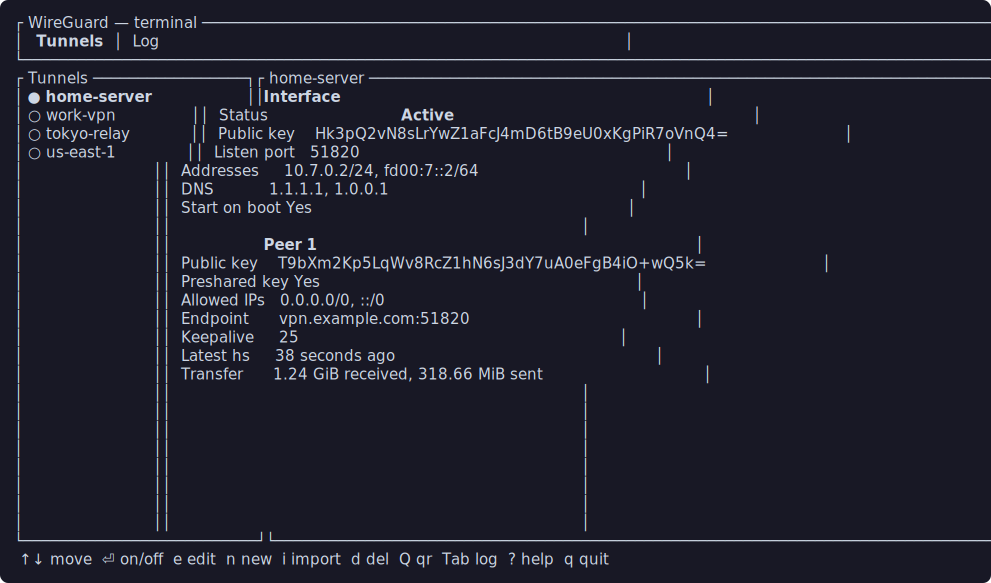

<div align="center">

# wireguard-tui - `wg-tui`

A native terminal UI for managing WireGuard tunnels on Linux.

Built with Rust + ratatui as a single native binary. No GUI stack. No Electron.
No WebView. No NetworkManager layer. It works over SSH on minimal servers and
manages plain `/etc/wireguard/*.conf` tunnels through `wg` and `wg-quick`, with
root operations kept behind a small auditable Rust helper.



[](https://github.com/JamilleJung/wireguard-tui/actions/workflows/ci.yml)
[](https://github.com/JamilleJung/wireguard-tui/releases/latest)
[](LICENSE)


</div>

Prefer a desktop window? The sibling
[`wireguard-gui`](https://github.com/JamilleJung/wireguard-gui) provides the same
project philosophy as a native Slint GUI.

## Design philosophy

This project is intentionally small.

It does not try to become a WireGuard platform, daemon, configuration database,
or browser dashboard. It stays close to the Linux WireGuard workflow: plain
`.conf` files in `/etc/wireguard`, `wg`, `wg-quick`, `wg show`, `wg showconf`,
`wg syncconf`, `wg-quick save`, systemd `wg-quick@<name>` units where available,
and the system journal.

The GUI and TUI are separate first-class tools. Install the one you want. Hack
the one you want. They share a privilege model and project direction, but there
is no mandatory runtime core, daemon, or hidden platform layer.

The goal is a native terminal client that is easy to use, easy to inspect, easy
to fork, and still close enough to WireGuard primitives that you can understand
what it is doing.

## Why a TUI?

Terminal users do not need a browser dashboard just to bring a tunnel up. They
also should not have to memorize scattered commands for routine operations.

`wg`, `wg-quick`, `systemctl`, and `journalctl` are powerful, but the workflow is
spread across several tools. `wg-tui` puts the common operator loop in one
terminal screen: tunnel list, active state, live details, logs, imports, QR
display, editing, diagnostics, and boot-time activation.

It is useful on laptops, servers, routers, SSH sessions, and minimal Linux
systems where a desktop stack is the wrong dependency.

## Screenshot


## What it does

### Everyday terminal workflow

- Lists tunnels from `/etc/wireguard`.
- Shows active/inactive state.
- Connects and disconnects with one key.
- Shows interface public key, listen port, addresses, DNS, and start-on-boot.
- Shows peer public key, preshared-key indicator, allowed IPs, endpoint,
  keepalive, latest handshake, and transfer totals.
- Shows live connection health and throughput.
- Refreshes without restarting.
- Provides a Log tab backed by journald where available.
- Copies the interface public key through OSC 52 when the terminal supports it.

### Config and import/export

- Edits the selected tunnel in `$VISUAL`, then `$EDITOR`, then `nano`.
- Creates temp editor files mode `0600` under a private user directory.
- Removes temp editor files after editing.
- Validates before save.
- Saves through the helper with backups and atomic replacement.
- Creates new tunnels from Interface-only, full-tunnel, or split-tunnel
  generated templates in Easy Mode.
- Generates keypairs and preshared keys.
- Imports `.conf` files.
- Imports QR-code images.
- Shows a terminal QR code for a tunnel.
- Exports all tunnels to `~/wireguard-tunnels.zip`.
- Renames and removes tunnels through helper verbs.

### Advanced operations

- Shows running config with `wg showconf`.
- Applies compatible saved edits to a running tunnel with `wg syncconf`.
- Saves live running state back to disk with `wg-quick save`.
- Toggles start-on-boot with systemd `wg-quick@<name>` when systemd is present.
- Toggles a helper-managed kill switch for active tunnels using nftables
  (preferred) or iptables/ip6tables.
- Provides Easy mode for everyday actions and Advanced mode for raw operations.
- Remembers the Easy/Advanced preference under the user config directory.

### Diagnostics

- `wg-tui doctor` prints a read-only checklist.
- `wg-tui setup` offers confirmation-based fixes for missing prerequisites.
- `docs/DISTROS.md` explains client vs server/gateway setup by distro.

## What it deliberately does not do

- No GUI dependencies.
- No desktop stack requirement.
- No NetworkManager dependency.
- No Electron.
- No WebView.
- No browser dashboard.
- No mandatory daemon or background service.
- No central runtime core shared by GUI and TUI users.
- No hidden config database.
- No bundled WireGuard kernel module.

## Install

### Prebuilt packages

The release page normally includes:

- `wireguard-tui_*_amd64.deb`
- `wireguard-tui-*-x86_64-linux.tar.gz`
- `wireguard-tui-*-aarch64-linux.tar.gz`
- `SHA256SUMS`
- `SHA256SUMS.minisig` when signing is configured
- `minisign.pub`

The first-party packages install `wg-tui`, `wg-helper`, and the authorization
rule. They do not install GUI libraries.

### Build from source

```sh
git clone https://github.com/JamilleJung/wireguard-tui.git
cd wireguard-tui
./install.sh
```

`install.sh` detects the package manager, installs `wireguard-tools` and build
requirements, ensures Rust when needed, builds the release binary as the
invoking user, installs the binary/helper, and configures helper authorization.

The default install stays server-friendly: no desktop entry and no icon. If you
want an app-menu launcher on a workstation:

```sh
./install.sh --desktop
```

Supported package managers:

| Distro family | Package manager |
|---|---|
| Debian / Ubuntu / Mint | `apt` |
| Fedora / RHEL / Rocky | `dnf` / `yum` |
| Arch / Manjaro / EndeavourOS | `pacman` |
| openSUSE | `zypper` |
| Alpine | `apk` |
| Void | `xbps-install` |
| Solus | `eopkg` |

Auth backend:

```sh
./install.sh           # sudoers drop-in, default
./install.sh --polkit  # polkit rule instead
```

Uninstall:

```sh
./install.sh uninstall
```

Tunnel configs in `/etc/wireguard` are left in place.

## Verify releases

Download the artifact you want plus `SHA256SUMS`. When `SHA256SUMS.minisig` is
attached, verify both the signature and checksum:

```sh
minisign -Vm SHA256SUMS -P RWTyrstfFCLYkpMwbcyBRl+aGGcJikl35GY1esJDO6HTEJFIMvUC8f1Q
sha256sum -c SHA256SUMS --ignore-missing
```

The public key is also committed as `minisign.pub`:

```sh
minisign -Vm SHA256SUMS -p minisign.pub
```

If the signature is not attached for a release, use `SHA256SUMS` as an integrity
check only and prefer building from source for higher assurance.

## Usage and key map

Launch:

```sh
wg-tui
# or the longer name:
wireguard-tui
```

CLI helpers (both names work):

```sh
wg-tui --version      # or: wireguard-tui --version
wg-tui --help         # or: wireguard-tui --help
wg-tui doctor         # or: wireguard-tui doctor
wg-tui setup          # or: wireguard-tui setup
```

Keys in the main UI:

| Key | Action |
|---|---|
| `Up` / `k`, `Down` / `j` | Move selection, or scroll the Log tab |
| `Enter` / `a` | Activate or deactivate the selected tunnel |
| `n` | Create a new tunnel from an Interface-only/full/split preset |
| `i` | Import a `.conf` file or QR image |
| `d` | Delete the selected tunnel |
| `s` | Toggle start-on-boot |
| `Q` | Show the tunnel as a QR code |
| `y` | Copy the interface public key with OSC 52 |
| `Tab` | Switch between Tunnels and Log |
| `m` | Toggle Easy / Advanced mode |
| `r` | Refresh now |
| `?` | Show help |
| `q` / `Esc` | Quit |

Advanced mode also enables:

| Key | Action |
|---|---|
| `e` | Edit the selected tunnel in `$VISUAL` / `$EDITOR` / `nano` |
| `g` | Generate a keypair and preshared key |
| `c` | Show the running config with `wg showconf` |
| `+` | Quick-add a new `[Peer]` section to the selected tunnel |
| `K` | Toggle the helper-managed kill switch for an active tunnel |
| `p` | Save live state with `wg-quick save` |
| `R` | Rename the selected tunnel |
| `x` | Export all tunnels to `~/wireguard-tunnels.zip` |

Import browser:

| Key | Action |
|---|---|
| `Space` | Mark/unmark a file for bulk import |
| `Enter` | Open a directory, import highlighted file, or import marked files |
| `Right` / `l` | Enter a directory |
| `Left` / `h` / `Backspace` | Go up one directory |
| `Esc` | Cancel import |

Easy mode shows everyday actions, including creating a tunnel. Advanced mode
adds raw editing, key generation, running config, kill switch, save-live,
rename, and export. The mode choice is remembered.

## Doctor and setup

```sh
wg-tui doctor
wg-tui setup
```

`doctor` is read-only, does not require root, and exits intentionally:

- `0` = OK
- `1` = warnings only
- `2` = critical missing requirements

It checks:

- `wg`
- `wg-quick`
- `/etc/wireguard`
- installed helper
- helper authorization
- systemd for start-on-boot
- journald/logger availability for logs
- `resolvconf` or systemd-resolved for configs with `DNS =`

`setup` is confirmation-based. It offers to install `wireguard-tools`, a
resolvconf provider, and `/etc/wireguard` when missing. It does not connect
tunnels, enable start-on-boot, delete configs, or install arbitrary config
files. It points you at `install.sh` or packages for helper installation.

## Security and privilege model

Designed with a small auditable privilege boundary:

- The TUI runs as a normal user.
- Root operations go through `wg-helper`.
- Authorization is scoped to the helper path, not to the TUI binary.
- Default source install uses a sudoers drop-in for the helper only.
- `./install.sh --polkit` installs a polkit rule for the helper only.
- If neither passwordless path is available, the app falls back to `pkexec`.
- The TUI can reuse a co-installed GUI helper when present.

The helper exposes fixed verbs only:

`list`, `active`, `read`, `dump`, `up`, `down`, `save`, `rename`, `delete`,
`enable`, `disable`, `is-enabled`, `sync`, `showconf`, `persist`, `log`,
`killswitch-status`, `killswitch-enable`, and `killswitch-disable`.

Helper hardening:

- Fixed `PATH`.
- Fixed `/etc/wireguard` root.
- Tunnel names must match `^[A-Za-z0-9][A-Za-z0-9_.-]{0,14}$`.
- Names containing `..`, slashes, backslashes, empty strings, or leading symbols
  are rejected.
- No caller-controlled root destination paths.
- No `eval` or `sh -c` around caller-controlled values.
- Command calls use argv-style arguments.
- Operations that may hang are wrapped with timeouts.
- Saves and renames validate config shape in the helper before replacing files.
- Saves and renames write a temp file, set mode `0600`, best-effort `sync -f`,
  and rename into place.
- Overwrite, rename, and delete create timestamped backups first.
- Mutating actions are logged without private keys.
- Kill switch verbs require an active `wg-quick` tunnel with a WireGuard fwmark,
  use iptables/ip6tables when present, and do not install a daemon.

Important WireGuard reality: `wg-quick` supports `PreUp`, `PostUp`, `PreDown`,
and `PostDown`. Those hooks run as root when a tunnel is activated. The TUI
flags imported or edited configs that contain them, but it does not remove them
because they are part of the plain WireGuard workflow. Treat imported configs
like scripts you might run as root.

QR and zip export contain private keys. Treat them like the config file itself.

## Hacking on it

This is MIT open source. Fork it to hack on your own ideas.

### Codebase map

| Path | Purpose |
|---|---|
| `src/main.rs` | App entrypoint, event loop, key handling, rendering |
| `src/backend.rs` | Helper client, WireGuard/system operations, QR/export |
| `src/config.rs` | WireGuard config parsing and validation |
| `src/create.rs` | Easy Mode tunnel templates and defaults |
| `src/clipboard.rs` | OSC52 single-field copy normalization |
| `src/secrets.rs` | Secret redaction and script-hook detection |
| `src/validation.rs` | Tunnel name validation and import-name sanitization |
| `src/doctor.rs` | Read-only checks and setup hints |
| `src/bin/wg-helper.rs` | Privileged Rust helper and fixed verb surface |
| `install.sh` | Distro-aware source installer |
| `tests/helper-validation.sh` | Shell tests for helper name validation |
| `docs/` | Tutorial, distro guide, release notes |
| `packaging/` | Polkit, AUR/RPM/APK/Void metadata, optional desktop assets |
| `.github/workflows/` | CI and release automation |

### Build and test

```sh
cargo fmt --all -- --check
cargo clippy --all-targets -- -D warnings
cargo test
cargo build --release
bash -n install.sh
bash -n tests/installer-sanity.sh
shellcheck -S warning install.sh tests/helper-validation.sh tests/installer-sanity.sh
bash tests/helper-validation.sh target/release/wg-helper
bash tests/installer-sanity.sh
target/release/wg-tui --help
target/release/wg-tui --version
target/release/wg-tui doctor
```

### Run from source

```sh
cargo run --release
```

During development, the binary can use the in-tree helper. You can also point it
at a helper explicitly:

```sh
cargo build --bin wg-helper
WG_HELPER=/absolute/path/to/wg-helper cargo run
```

In release builds, `WG_HELPER` is ignored unless `WG_ALLOW_UNSAFE_HELPER=1` is
set and the target is an absolute, root-owned, non-world-writable file. That is
intentional: a helper override can become a root boundary.

### Adding an action safely

Keep normal terminal actions in `src/main.rs`. If an action needs root, add a
fixed helper verb, validate tunnel names before filesystem access, keep paths
fixed, avoid shell expansion, create backups before destructive changes, and do
not log private keys.

## Troubleshooting

- `wg-tui doctor` reports missing `wg` or `wg-quick`: install
  `wireguard-tools`.
- `DNS for tunnels (resolvconf)` is a warning: install `openresolv` or use
  systemd-resolved if your configs use `DNS =`.
- The helper prompts every time: run `./install.sh` or `./install.sh --polkit`
  so the installed helper path is authorized.
- Kill switch fails: the tunnel must be active and the system needs nftables, iptables, or ip6tables available.
- Start-on-boot is unavailable: the system does not provide `systemctl`.
- The Log tab is empty: `journalctl` is missing or the system is not using
  journald.
- The QR code is too large: enlarge the terminal or reduce font size, then press
  `Q` again.
- `y` does not copy: the terminal or multiplexer does not allow OSC 52 clipboard
  writes.
- `$EDITOR` with complex shell quoting is not parsed like a shell command. Use a
  simple editor command or wrapper script.

## Known limitations

- Start-on-boot is systemd-only.
- The release workflow builds x86_64 and aarch64 tarballs; `.deb` coverage
  remains x86_64-focused.
- Editing uses an external editor by design.
- Terminal QR codes can be large.
- OSC 52 copy depends on terminal support.
- The project does not bundle WireGuard tools or kernel modules.
- The kill switch is intentionally helper-managed firewall state, not a daemon
  or persistent firewall manager.

## Roadmap

- More distro packages where maintainers want them (COPR, official Alpine/Void).

## License

MIT. WireGuard is a registered trademark of Jason A. Donenfeld. This is an
independent, unofficial client and is not affiliated with or endorsed by the
WireGuard project.
